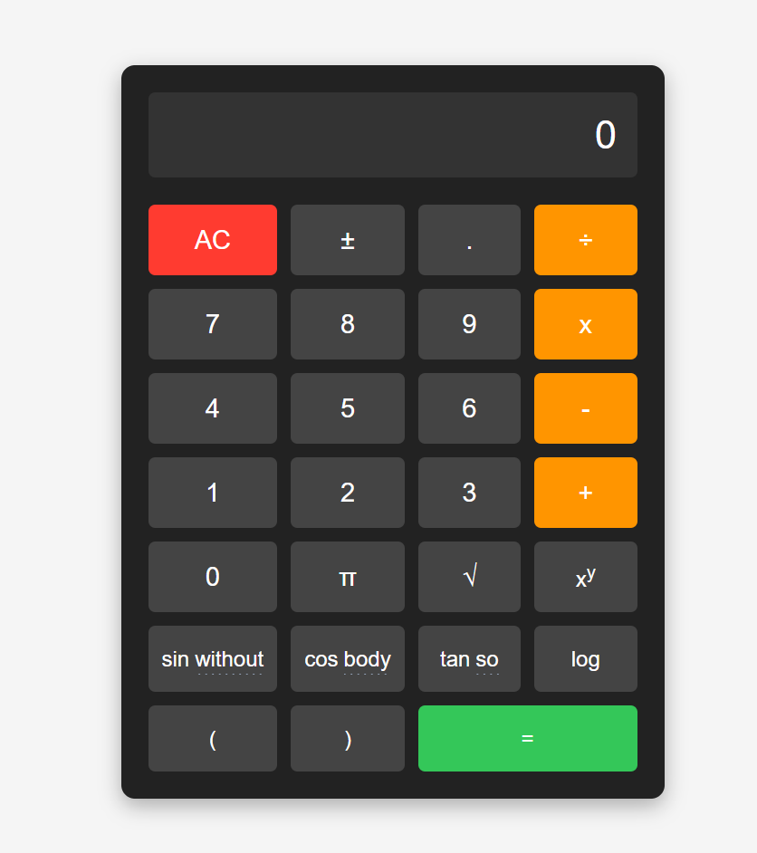

# Scientific Calculator Web App

A responsive, browser-based **Scientific Calculator** built with HTML, CSS, and JavaScript. It provides both basic arithmetic and advanced scientific functions in a user-friendly layout.

## 🚀 Features

- Arithmetic: Add, Subtract, Multiply, Divide
- Scientific Functions:
  - Trigonometry: `sin`, `cos`, `tan`
  - Logarithmic: `log`
  - Power (`xʸ`), Square Root (`√`)
  - Constants: `π`
- Responsive UI design
- Error handling for invalid input

## 📸 Screenshot



## 🛠️ Technologies Used

- **HTML5** – Page structure
- **CSS3** – Styling and layout
- **JavaScript (ES6)** – Calculator logic

## 📂 Project Structure

```
├── index.html      # Markup for the calculator
├── styles.css      # CSS for layout and responsiveness
├── script.js       # Logic for evaluation and interaction
├── screenshot.png  # Screenshot
```

## 💡 How to Run

1. Clone or download the repository.
2. Open `index.html` in a modern web browser.
3. Use the calculator via mouse/tap.

## ⚠️ Known Issues

- `±` button is currently not functional.
- Some scientific inputs like `sin`, `cos`, etc., need closing brackets manually.

## 📄 License

This project is released under the [MIT License](LICENSE).
